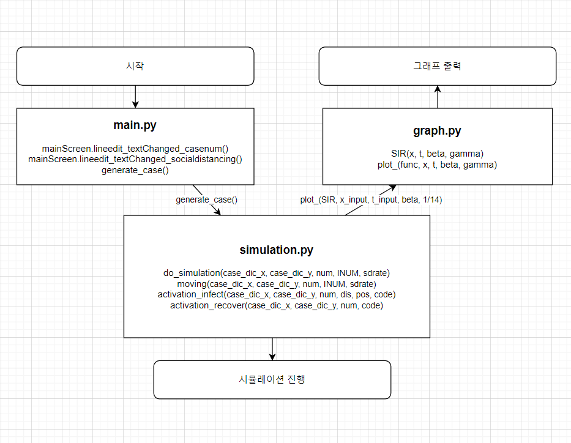
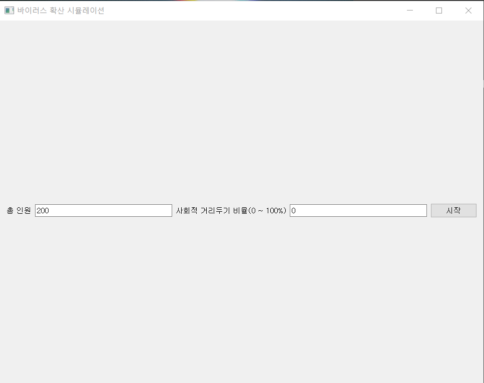
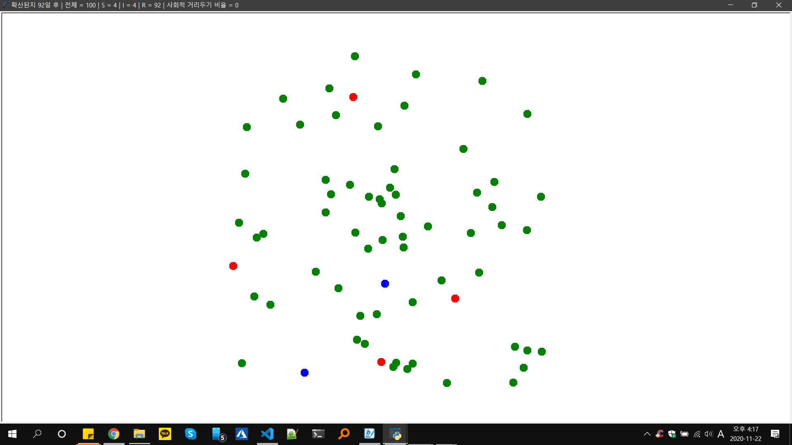
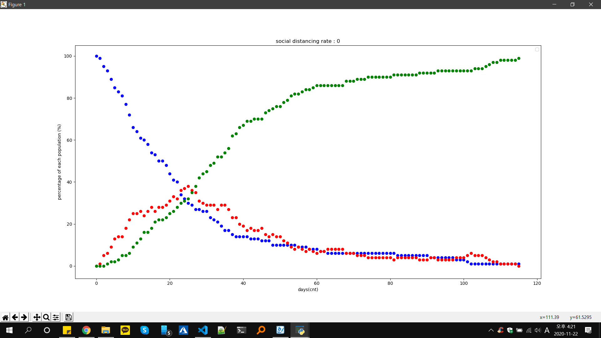
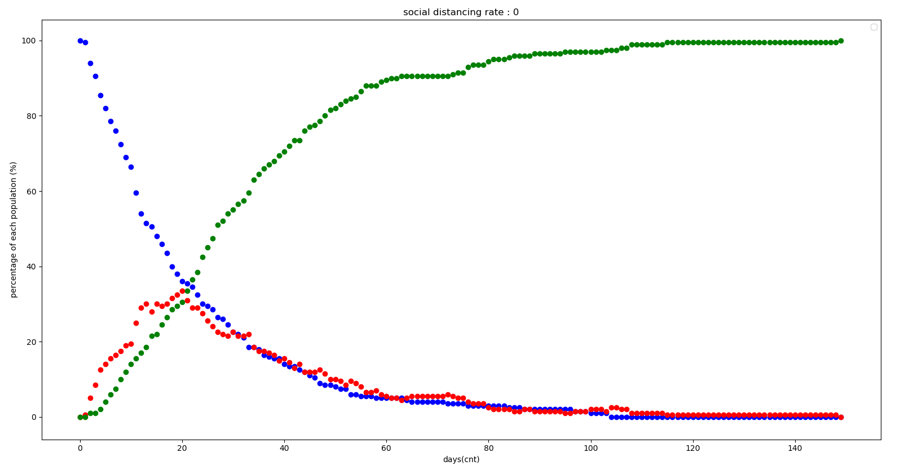
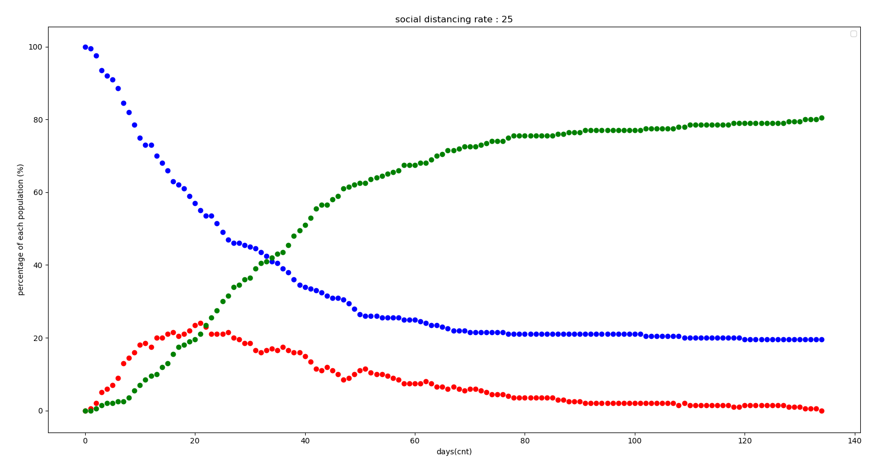
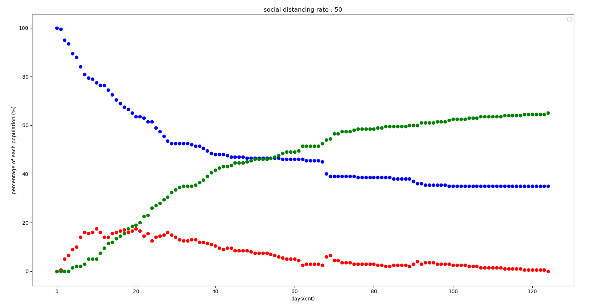
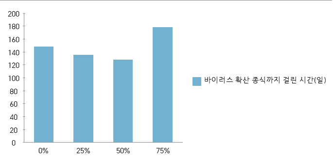

# Virus Diffusion Simulation Project  
### 사회적 거리두기와 COVID-19 확산의 상관관계 분석

바이러스 확산 시뮬레이션 프로그램을 직접 개발하여  
**사회적 거리두기 강도와 감염 확산 양상 사이의 상관관계**를 분석한 연구 프로젝트입니다.

---

## 1. Research Background

COVID-19 확산 이후 사회적 거리두기는 가장 중요한 방역 수단 중 하나가 되었습니다.  
하지만 실제로 **사회적 거리두기가 바이러스 확산에 얼마나 큰 영향을 미치는지**에 대해서는  
직관적으로 이해하기 어려운 측면이 존재합니다.

본 연구는 이러한 궁금증을 해결하고,  
사회적 거리두기의 효과를 **시각적으로 이해할 수 있도록**  
바이러스 확산 시뮬레이션 프로그램을 직접 구현하여 분석을 진행하였습니다.

---

## 2. Research Objective

- 사회적 거리두기 강도에 따른 감염 확산 양상 비교
- 취약자(S), 감염자(I), 회복자(R)의 시간에 따른 변화 분석
- 사회적 거리두기의 사회적·의료적 파급 효과 분석
- 시뮬레이션 기반 데이터 분석을 통한 정량적 근거 제시

---

## 3. Simulation Overview

본 연구에서는 실제 사람을 대상으로 실험하는 대신,  
**바이러스 확산 시뮬레이션 프로그램**을 이용해 안전하고 효율적인 연구를 수행하였습니다.

### 시뮬레이션 조건

- 총 인원(case): 200명
- 사회적 거리두기 비율:  
  - 0% (미적용)  
  - 25%  
  - 50%  
  - 75%
- 각 조건별 1회 시뮬레이션 수행

---

## 4. Tech Stack

- **Python 3**
- **PyQt5** – GUI 구현
- **OpenCV (기초 개념 활용)**
- **numpy** – 데이터 처리
- **matplotlib** – 결과 시각화
- **turtle** – 개체 이동 시각화
- **random / sys**

---

## 5. Program Architecture

프로그램은 기능별로 3개의 Python 파일로 구성되어 있습니다.

- main.py # 입력 UI 및 초기 조건 설정
- simulation.py # 바이러스 확산 시뮬레이션 로직
- graph.py # S / I / R 변화 그래프 시각화

### 전체 구조 개요

---

## 6. Simulation UI & Visualization

### 입력 화면
총 인원 수와 사회적 거리두기 비율을 입력합니다.

---

### 시뮬레이션 진행 화면

- 🔵 파란색: 취약자 (Susceptible)
- 🔴 빨간색: 감염자 (Infected)
- 🟢 초록색: 회복자 (Recovered)

---

### 실시간 SIR 변화 그래프

시뮬레이션 진행 중 시간에 따른 각 집단의 비율 변화를 실시간으로 시각화합니다.

---

## 7. Results & Analysis

### 사회적 거리두기 강도별 감염자 변화

#### 사회적 거리두기 0%

#### 사회적 거리두기 25%

#### 사회적 거리두기 50%

#### 사회적 거리두기 75%

### 분석 결과

- 사회적 거리두기 강도가 높아질수록  
  👉 감염자 증가 곡선이 **완만(flatten)** 해짐
- 취약자(S)의 감소 폭이 현저히 줄어듦
- 감염 확산 속도가 느려져 의료 시스템 부담 감소 가능

> **결론:**  
> 사회적 거리두기 강도가 강할수록  
> 바이러스 확산 속도는 감소하고, 감염 규모는 유의미하게 줄어든다.

---

## 8. Virus Extinction Time Analysis

사회적 거리두기 비율에 따른  
**바이러스 확산 종식까지 소요된 시간**을 비교하였습니다.

### Interpretation

- 사회적 거리두기 강도와 종식 시점 사이에는  
  **뚜렷한 상관관계는 없음**
- 하지만 확산 속도 완화 효과는 매우 큼

---

## 9. Limitations

- 시뮬레이션 1회 수행으로 통계적 한계 존재
- 개체 수 증가 시 연산 속도 저하
- 단순 거리 기반 감염 모델 사용

---

## 10. Future Improvements

- 시뮬레이션 최적화를 통한 성능 개선
- 반복 실험을 통한 통계적 신뢰성 확보
- SEIR 모델로 확장 (잠복기 고려)
- 실제 SIR 모델 기반 수학적 요소 강화

---

## 11. Source Code

🔗 GitHub Repository  
[https://github.com/lamiro3/virus_diffusion_simulation_program](https://github.com/lamiro3/Python/tree/main/virus_diffusion_simulation_program)

---

## 12. Conclusion

본 연구는 사회적 거리두기가  
**바이러스 확산을 늦추고, 감염 규모를 줄이는 데 매우 효과적**임을  
시뮬레이션 기반으로 입증하였습니다.

특히, 시각적 결과를 통해  
비전공자도 쉽게 사회적 거리두기의 중요성을 이해할 수 있도록 했다는 점에서  
의의가 있습니다.
